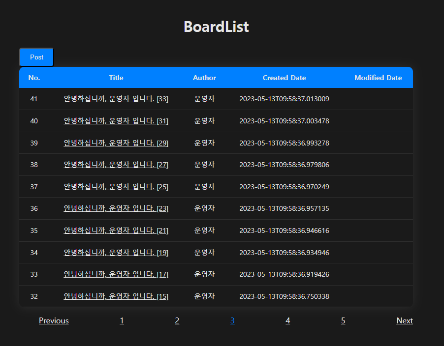
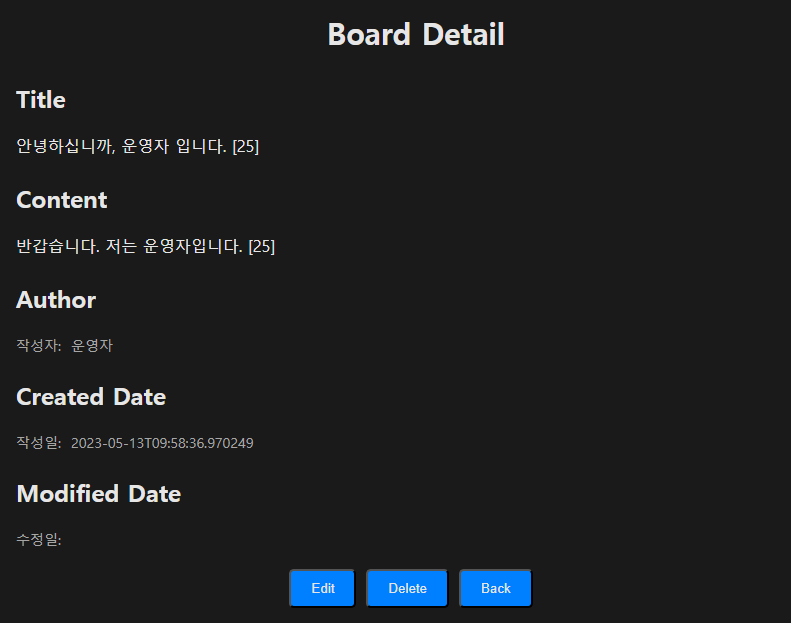
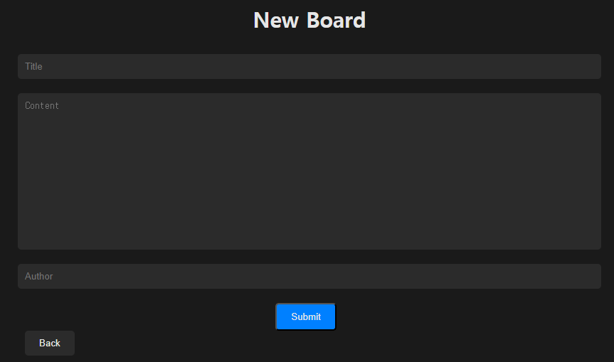
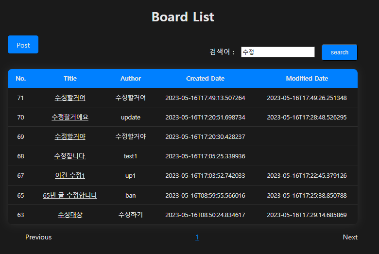

# Spring boot board project

Spring Boot를 사용한 게시판 구현 예제 입니다. Spring boot + Spring Data JPA + h2 + Thymeleaf 를 사용하여 개발하였습니다.

## To do list - Main
- [x] Board - CRUD
  - [x] create
  - [x] read all + paging
  - [x] read detail
  - [x] delete
  - [x] update

## To do list - detail
- [x] board list에서 상세보기 시 page number 전달하기
- [x] board delete 후 동작 추가
- [x] board 등록 화면 추가
- [x] board 등록 기능 추가
- [x] board 수정 기능 추가
- [x] boardForm 에 등록/수정 기능 적용
- [x] keyword 검색 기능 추가

## Application preview

Board List를 보여주는 화면 입니다.

Board 상세 보기 화면 입니다.

Board Form 게시글 입력 화면 입니다.

Board List - Keyword Search 화면 입니다.

### init-project
