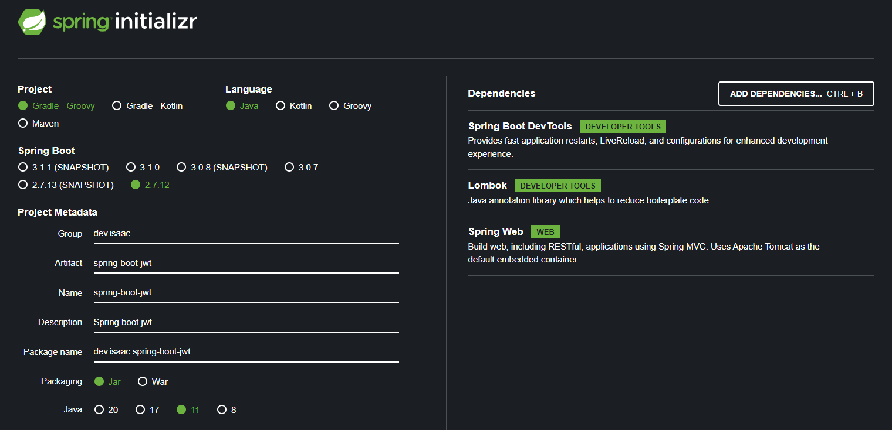

# Spring boot jwt
이 프로젝트는 jwt 를 생성하고, jwt 에 담긴 내용을 확인할 수 있는 example 입니다.

주요 class : SecurityServiceImpl.java

project config



Dependencies
```
dependencies {
    implementation 'org.springframework.boot:spring-boot-starter-web'
    compileOnly 'org.projectlombok:lombok'
    developmentOnly 'org.springframework.boot:spring-boot-devtools'
    annotationProcessor 'org.projectlombok:lombok'
    testImplementation 'org.springframework.boot:spring-boot-starter-test'
	
    implementation 'io.jsonwebtoken:jjwt:0.9.1'
    implementation 'javax.xml.bind:jaxb-api:2.3.1'
}
```
