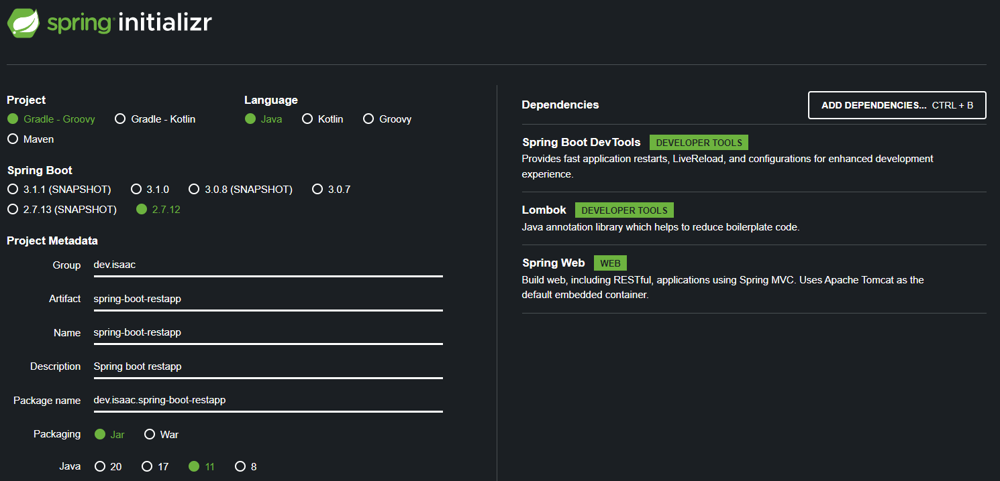

# Spring boot restapp

### start


### Spring-WebMVC 에서 RESTful 지원
아래 3개 Annotation 사용
- @Controller
- @RequestMapping(value="url",method=POST/GET/DELETE/PUT)
- @ResponseBody

```java
@Controller
public class IndexController {

    @RequestMapping(value = "/", method = RequestMethod.GET)
    @ResponseBody
    public String index() {
        return "Hello, Boot";
    }
}
```

### Spring Boot 에서의 RESTful 지원
아래 2개 Annotation 사용
- @RestController
- @X-Mapping 사용

```java
@RestController
public class IndexController {
    @GetMapping("/")
    public String index() {
        return "Hello, Boot";
    }
}
```
@RestController 내부에 @Controller, @ResponseBody 가 포함되어 있다.
@GetMapping 내부에는 @RequestMapping(value="/", method = RequestMethod.GET) 이 포함되어 있다.

기존의 @Controller, @ResponseBody 이 두 어노테이션을 사용해 json type 의 body 데이터를 응답하도록 합쳐 놓은 것이 @RestController 이다.

---
jwt set