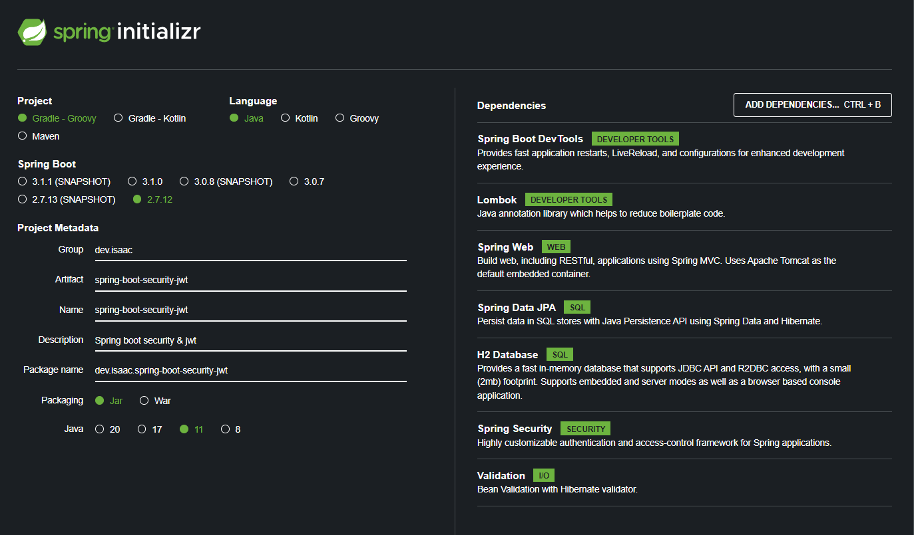
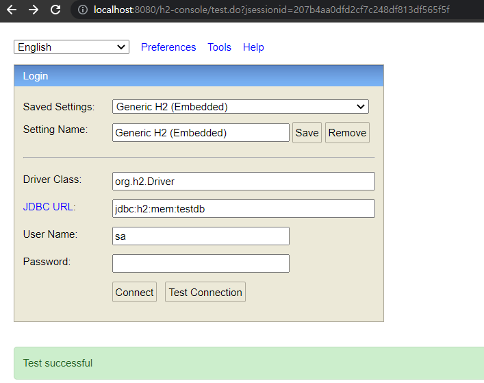

# Spring boot security & jwt
spring boot security & jwt 를 사용한 example project 입니다.

project init config

h2-console 페이지 접속 : http://localhost:8080/h2-console

h2-console 접속 방법

to do list
- [x] entity set
- [x] Spring Boot Security 기본 설정
- [x] data settings
- [ ] jwt 설정 추가
- [ ] jwt 관련 코드 개발
- [ ] Security + jwt 적용