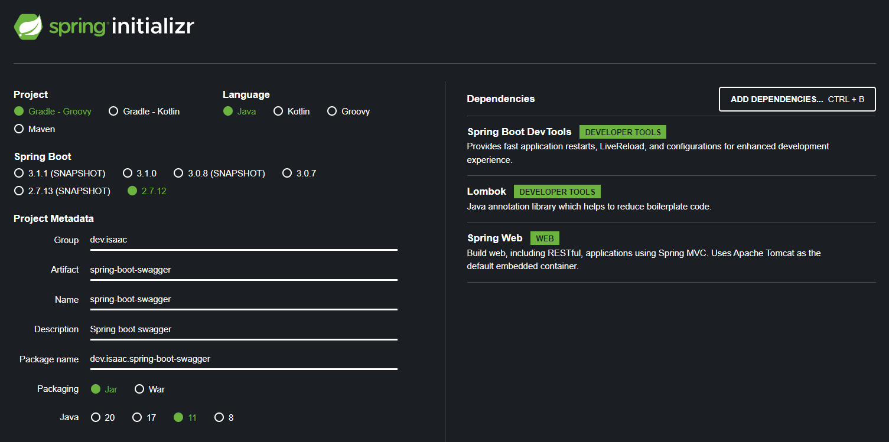

# Spring boot swagger

project init config


build.gradle
```gradle
dependencies { 
    implementation "io.springfox:springfox-boot-starter:3.0.0"
}
```

application.properties
```properties
spring.mvc.pathmatch.matching-strategy=ant_path_matcher
```

swagger-ui docs 접속 uri : http://localhost:8081/swagger-ui/
